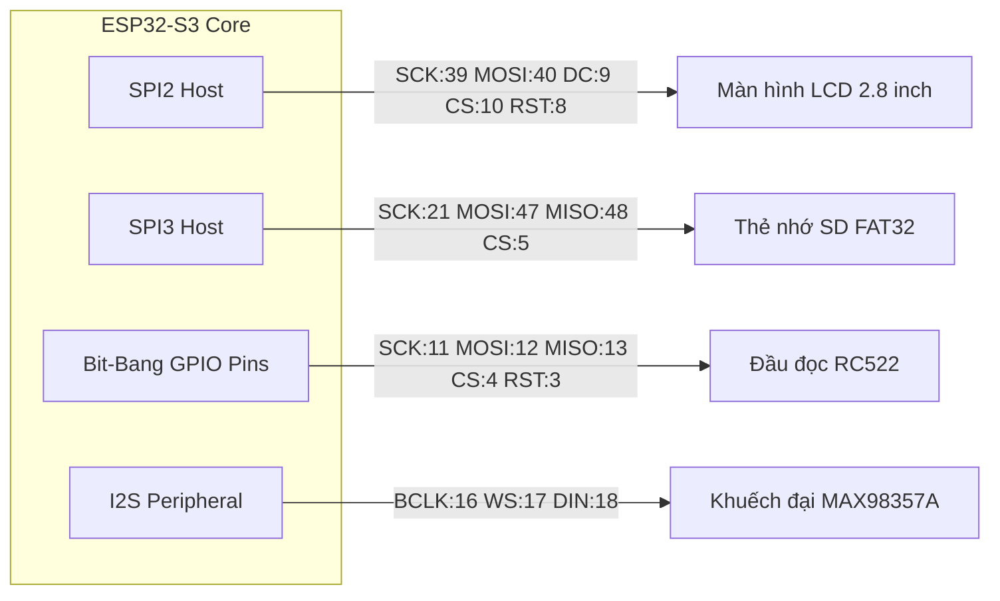
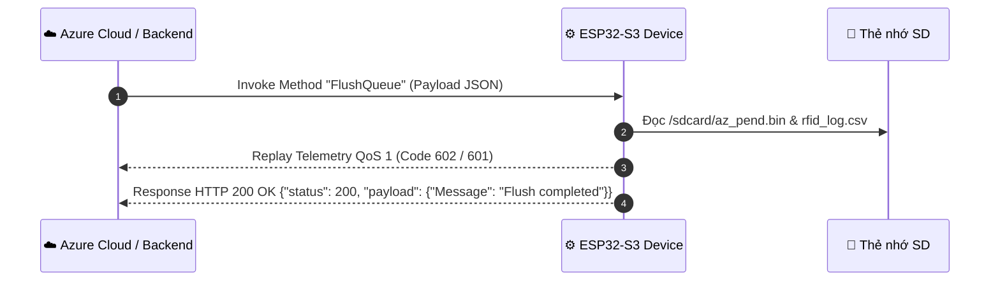
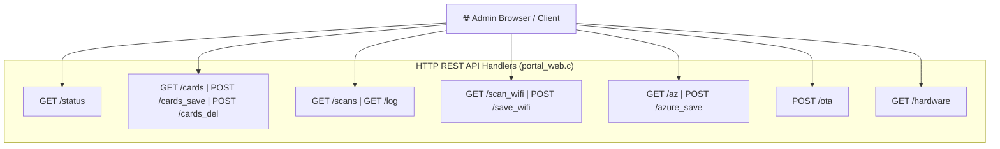

# 📘 ESP32-S3 RFID Attendance & Access Control System — Technical Documentation
> **Tài liệu Kỹ thuật Chi tiết Chuẩn Chuyên nghiệp (Standard Technical Specification & Architecture Manual)**  
> **Phiên bản Firmware**: v2.5.1 | **Dự án**: MebiEco RFID Kiosk | **Framework**: ESP-IDF v5.x

---

## 📌 Mục lục

1. [Tổng quan Hệ thống (System Overview)](#1-tổng-quan-hệ-thống-system-overview)
2. [Kiến trúc Phần cứng & Pinout Matrix](#2-kiến-trúc-phần-cứng--pinout-matrix)
3. [Cấu trúc Phần mềm & Phân tích Module](#3-cấu-trúc-phần-mềm--phân-tích-module)
4. [Cơ chế Đa nhiệm FreeRTOS & Quản lý Tài nguyên](#4-cơ-chế-đưa-nhiệm-freertos--quản-lý-tài-nguyên)
5. [Cấu trúc Bộ nhớ & Thẻ nhớ SD FAT32](#5-cấu-trúc-bộ-nhớ--thẻ-nhớ-sd-fat32)
6. [Giao thức Kết nối Cloud Azure IoT Hub (MQTT)](#6-giao-thức-kết-nối-cloud-azure-iot-hub-mqtt)
7. [Tài liệu Chi tiết REST API Web Portal](#7-tài-liệu-chi-tiết-rest-api-web-portal)
8. [Quy trình Build, Pack Web & Nạp Firmware](#8-quy-trình-build-pack-web--nạp-firmware)
9. [Hướng dẫn Chẩn đoán & Xử lý Lỗi (Troubleshooting)](#9-hướng-dẫn-chẩn-đoán--xử-lý-lỗi-troubleshooting)

---

## 1. Tổng quan Hệ thống (System Overview)

Thiết bị **ESP32-S3 RFID Attendance System** là một hệ thống kiosk chấm công và kiểm soát vào/ra thông minh hoạt động thời gian thực (Real-time IoT Attendance Kiosk). Hệ thống kết hợp khả năng quẹt thẻ RFID tần số high-frequency (13.56MHz), hiển thị giao diện người dùng tiếng Việt qua LVGL trên màn hình LCD, phát phản hồi âm thanh chất lượng cao qua I2S, đồng bộ dữ liệu hai chiều với Cloud Azure IoT Hub qua MQTT, và tích hợp Web Server nội bộ cho việc cấu hình và quản trị tại chỗ.

```mermaid
graph TD
    subgraph Users [" 👤 Người dùng & Quản trị "]
        Employee["👤 Nhân viên (Quẹt thẻ)"]
        AdminWeb["💻 Quản trị viên (Web Browser)"]
        AzureBackend["☁️ Azure Cloud Backend / Operator"]
    end

    subgraph Peripherals [" 🔌 Ngoại vi Phần cứng "]
        RC522["📇 MFRC522 RFID Reader"]
        LCD["📺 LCD ILI9341 / GMT028 (LVGL)"]
        Audio["🔊 MAX98357A I2S Amplifier"]
        SDCard["💾 SD Card (FAT32)"]
    end

    subgraph ESP32S3 [" ⚙️ ESP32-S3 Firmware Core (ESP-IDF v5.x) "]
        RFID_Task["app_rfid (Task Quẹt thẻ & Logic Chấm công)"]
        UI_Task["lcd_ui (Task Render Giao diện LVGL 8.3)"]
        Audio_Task["app_audio (Task Phát Âm thanh WAV I2S)"]
        WiFi_Task["wifi_portal / portal_web (Task Web Server & SoftAP/STA)"]
        Azure_Task["app_azure (Task Client Azure MQTT & Offline Queue)"]
        OTA_Module["app_ota (Module Nâng cấp Firmware OTA)"]
        Log_Module["scan_log & card_profile (Module Ghi CSV & Tra Profile)"]
    end

    Employee -->|Chạm thẻ MIFARE| RC522
    RC522 -->|Giao tiếp Bit-bang SPI| RFID_Task
    RFID_Task -->|Tra cứu Profile & Checkin| Log_Module
    Log_Module <-->|Đọc / Ghi| SDCard
    RFID_Task -->|Kích hoạt Popup UI| UI_Task
    UI_Task -->|Đầu ra SPI2| LCD
    RFID_Task -->|Kích hoạt Chuông WAV| Audio_Task
    Audio_Task -->|Đầu ra I2S| Audio
    RFID_Task -->|Enqueue Telemetry| Azure_Task
    Azure_Task <-->|Giao tiếp MQTT (QoS 1)| AzureBackend
    AdminWeb <-->|HTTP REST / HTML Gzip| WiFi_Task
    AzureBackend -->|Kích hoạt OTA| OTA_Module
```

### Bảng Thông số Kỹ thuật Chi tiết

| Hạng mục | Chi tiết Kỹ thuật |
| :--- | :--- |
| **Vi điều khiển Core** | ESP32-S3 Dual-Core Xtensa LX7 (Tần số 240 MHz), tích hợp PSRAM (Yêu cầu $\ge 2\text{MB}$ PSRAM) |
| **Hệ điều hành / OS** | FreeRTOS (ESP-IDF v5.x C Native Framework) |
| **Màn hình & UI** | LCD ILI9341 / GMT028 2.8 inch ($320 \times 240$ px), Thư viện LVGL 8.3, Font tiếng Việt Arial Unicode 24/32/48 |
| **Đầu đọc Thẻ RFID** | MFRC522 (Chuẩn MIFARE 13.56 MHz, đọc UID 4-byte/7-byte) |
| **Bộ nhớ Lưu trữ** | Thẻ nhớ SD Card FAT32 (Chế độ SPI3, tốc độ $\le 10\text{MHz}$), SPIFFS (Storage), Flash NVS (Non-Volatile Storage) |
| **Âm thanh Phản hồi** | Loa MAX98357A I2S Class-D amplifier, đọc file WAV 16-bit Mono/Stereo trực tiếp từ thẻ SD |
| **Kết nối Cloud** | Azure IoT Hub qua MQTT protocol (TLS 1.2, Port 8883, SAS Token Auth, Offline Queue tự bù dữ liệu) |
| **Quản trị Nội bộ** | Web Portal nén HTML Gzip nhúng ROM, hỗ trợ 2 chế độ SoftAP (`192.168.4.1`) và STA Local Network |
| **Cập nhật Firmware** | Dual OTA partitions (`ota_0`, `ota_1` 4MB mỗi vùng) hỗ trợ OTA URL & HTTP File Upload |

---

## 2. Kiến trúc Phần cứng & Pinout Matrix

Tất cả các chân GPIO phần cứng được quy hoạch và định nghĩa trung tâm tại [`main/board_pins.h`](file:///c:/esp/RFID/main/board_pins.h). Hệ thống ưu tiên tách biệt bus ngoại vi để tránh xung đột băng thông và lỗi DMA.



### 1. Màn hình LCD ILI9341 / GMT028 (SPI2 Bus)
Bus SPI2 được dành riêng cho hiển thị giao diện LVGL tốc độ cao.

| Tín hiệu | Mã GPIO | Trạng thái / Chức năng | Ghi chú Kỹ thuật |
| :--- | :---: | :---: | :--- |
| **SPI Clock (SCK)** | `GPIO 39` | Output | Tần số clock SPI2 ~40MHz |
| **SPI Data Out (MOSI)** | `GPIO 40` | Output | Dữ liệu hình ảnh RGB565 |
| **SPI Data In (MISO)** | `GPIO 41` | Input | Đọc phản hồi (tùy chọn) |
| **Data/Command (DC)** | `GPIO 9` | Output | 0 = Command, 1 = Data |
| **Chip Select (CS)** | `GPIO 10` | Output | Active LOW |
| **Reset (RST)** | `GPIO 8` | Output | Active LOW Reset |
| **Backlight (BL)** | `NC` | Output | Nối cứng VCC hoặc điều khiển PWM |

### 2. Thẻ nhớ SD Card (SPI3 Bus)
Bus SPI3 phục vụ giao tiếp đọc/ghi dữ liệu profile, âm thanh WAV và log CSV.

| Tín hiệu | Mã GPIO | Trạng thái / Chức năng | Ghi chú Kỹ thuật |
| :--- | :---: | :---: | :--- |
| **SPI Clock (SCK)** | `GPIO 21` | Output | Tần số $4\text{MHz} - 10\text{MHz}$ |
| **SPI MOSI (DI)** | `GPIO 47` | Output | Ghi dữ liệu SD |
| **SPI MISO (DO)** | `GPIO 48` | Input | Đọc dữ liệu SD (Cần Pull-up) |
| **Chip Select (CS)** | `GPIO 5` | Output | Active LOW Chip Select SD |

### 3. Đầu đọc thẻ RFID MFRC522 (Bit-bang SPI Pins)
Mặc định hệ thống sử dụng **Bit-bang SPI tách biệt** trên GPIO tự do để tránh xung đột với bus SD Card.

| Tín hiệu | Mã GPIO | Trạng thái / Chức năng | Ghi chú Kỹ thuật |
| :--- | :---: | :---: | :--- |
| **Bit-bang SCK** | `GPIO 11` | Output | Software Clock Pulse |
| **Bit-bang MOSI** | `GPIO 12` | Output | Software Data Output |
| **Bit-bang MISO** | `GPIO 13` | Input | Software Data Input |
| **Chip Select (CS)** | `GPIO 4` | Output | Active LOW RFID CS |
| **Reset (RST)** | `GPIO 3` | Output | Power-down / Hardware Reset |

> [!TIP]
> Có thể chuyển sang dùng chung SPI3 bus giữa RC522 và SD Card bằng cách bật `#define BOARD_RC522_SHARE_SD_SPI_BUS 1` trong [`main/board_pins.h`](file:///c:/esp/RFID/main/board_pins.h).

### 4. Mạch Khuếch đại Âm thanh I2S MAX98357A

| Tín hiệu | Mã GPIO | Trạng thái / Chức năng | Ghi chú Kỹ thuật |
| :--- | :---: | :---: | :--- |
| **Bit Clock (BCLK)** | `GPIO 16` | Output | Transmit Bit Clock |
| **Word Select (WS / LRCLK)** | `GPIO 17` | Output | Left/Right Channel Select |
| **Data In (DIN)** | `GPIO 18` | Output | Digital Audio Stream Out |

---

## 3. Cấu trúc Phần mềm & Phân tích Module

Mã nguồn nằm trong thư mục [`main/`](file:///c:/esp/RFID/main) được cấu trúc thành các module chức năng độc lập, giao tiếp thông qua Event Queue và NVS Shared State.

```text
main/
├── main.c                 # Khởi tạo NVS, hệ thống ngoại vi & tạo các FreeRTOS Tasks
├── board_pins.h           # Định nghĩa chân GPIO hardware & Feature Flags cấu hình
├── app_rfid.c / .h        # Task quét thẻ RC522, kiểm tra checkin & kích hoạt UI/Audio
├── mfrc522.c / .h         # Driver thanh ghi & thủ tục truyền nhận SPI cho MFRC522
├── card_profile.c / .h    # Bộ quản lý tra cứu profile nhân viên (TXT/JPG) trên SD & Cache
├── attendance_day.c / .h  # API thống kê tổng quan danh sách chấm công theo ngày
├── scan_log.c / .h        # Trình quản lý log rfid_log.csv & Hàng đợi Offline Queue Azure
├── wifi_portal.c / .h     # Quản lý WiFi SoftAP/STA, mDNS, & HTTP Server dispatcher
├── portal_web.c / .h      # API REST endpoints & phục vụ trang Web Portal Gzip nhúng ROM
├── app_azure.c / .h       # Task MQTT Client Azure IoT Hub, SAS Token generator & Direct Methods
├── app_audio.c / .h       # Task giải mã & phát file âm thanh WAV qua I2S DAC
├── app_ota.c / .h         # Module nạp Firmware OTA (HTTP/HTTPS URL & Web Upload)
├── lcd_ui.c / .h          # Task điều khiển màn hình LVGL 8.3 & Hiển thị Popup/Status Bar
├── lv_port*.c / .h        # Drivers tích hợp màn hình LCD ILI9341/GMT028 với LVGL
└── sd_card.c / .h         # Driver mount thẻ nhớ SPI FAT32 & Cấu hình DMA Bounce Buffer
```

### Phân tích Chi tiết các Module Chính

#### 1. [`main.c`](file:///c:/esp/RFID/main/main.c) — Entry Point Hệ thống
- **Nhiệm vụ**: Đặt làm điểm khởi tạo `app_main()`. Khởi tạo flash NVS (`nvs_flash_init`), nạp cấu hình hệ thống, mount thẻ nhớ SD (`sd_card_init`), khởi tạo màn hình LCD LVGL (`lv_port_init`), khởi tạo I2S Audio (`app_audio_init`), và khởi chạy các Task FreeRTOS độc lập theo thứ tự phụ thuộc.

#### 2. [`app_rfid.c`](file:///c:/esp/RFID/main/app_rfid.c) — Xử lý Quẹt thẻ & Chấm công
- **Nhiệm vụ**: Chạy vòng lặp quét thẻ RFID liên tục tần số ~10Hz. Khi phát hiện UID:
  1. Tránh quẹt lặp (Debounce UID trong khoảng thời gian chống trùng thẻ).
  2. Gọi `card_profile_get()` tra cứu thông tin nhân viên (Tên, Mã NV) từ SD Card.
  3. Kiểm tra file `/sdcard/checkin/<UID>.bin` để xác định trạng thái **Vào (IN)** hay **Ra (OUT)**.
  4. Ghi bản ghi vào nhật ký `/sdcard/rfid_log.csv` bằng module `scan_log_add_entry()`.
  5. Đưa bản ghi vào hàng đợi Azure Offline Queue để gửi Cloud.
  6. Phát tín hiệu hiển thị Popup trên màn hình LCD qua `lcd_ui_show_card_result()`.
  7. Phát âm thanh WAV phản hồi tương ứng (`1.wav` cho Vào, `2.wav` cho Ra, `3.wav` cho Chưa đăng ký).

#### 3. [`scan_log.c`](file:///c:/esp/RFID/main/scan_log.c) — Quản lý Nhật ký & Azure Queue
- **Nhiệm vụ**: Duy trì file CSV chuẩn trên SD Card (`/sdcard/rfid_log.csv`). Quản lý chỉ số tăng dần `idx_swipe` (thẻ hợp lệ), `idx_unkn` (thẻ lạ), `idx_admin` (thao tác thẻ). Quản lý file hàng đợi nhị phân `/sdcard/az_pend.bin` khi mất kết nối mạng Azure IoT Hub và tự động đẩy bù khi MQTT phục hồi (`scan_log_flush_pending_queue`).

#### 4. [`app_azure.c`](file:///c:/esp/RFID/main/app_azure.c) — Kết nối Azure Cloud & Direct Methods
- **Nhiệm vụ**: Kết nối bảo mật MQTT over TLS 1.2 tới Azure IoT Hub (`port 8883`). Tự động sinh SAS Token từ Device SAS Key với thời gian thực NTP.
- **Xử lý Direct Methods**: Đăng ký topic `$iothub/methods/POST/#`, giải mã payload JSON và thực thi các lệnh từ xa:
  - `FlushQueue` (Code 605): Gửi bù nhật ký offline theo yêu cầu.
  - `TriggerOTA` (Code 606): Bắt đầu quá trình nạp firmware OTA.
  - `ChangeHub` (Code 607): Đổi thông số Azure Hub và reboot.
  - `DeviceCommand`: Hỗ trợ mã lệnh tổng hợp (Code 600 Reset, 603 Save Profile, 604 Delete Profile, 611/612 Chuyển LCD Driver).

#### 5. [`wifi_portal.c`](file:///c:/esp/RFID/main/wifi_portal.c) & [`portal_web.c`](file:///c:/esp/RFID/main/portal_web.c) — Web Server & Quản trị
- **Nhiệm vụ**: Khởi chạy HTTP Server trên Port 80. Khi mất kết nối WiFi STA, tự động phát WiFi SoftAP (SSID: `RFID_Portal_XXXX`, Password: mặc định hoặc không pass). Phục vụ trang quản trị HTML Gzip nén trong flash ROM. Cung cấp đầy đủ REST API endpoints để quản lý danh sách thẻ, xem log, cấu hình WiFi/Azure, kiểm tra thông số phần cứng Heap/DMA và nạp file OTA `.bin`.

---

## 4. Cơ chế Đa nhiệm FreeRTOS & Quản lý Tài nguyên

Hệ thống phân bổ CPU Core và mức ưu tiên Task (Task Priority) hợp lý để đảm bảo việc đọc thẻ RFID không bị gián đoạn (Real-time Latency $< 200\text{ms}$).

```mermaid
gantt
    title Phân bổ Ưu tiên Task FreeRTOS trên ESP32-S3
    dateFormat X
    axisFormat %s

    section Core 1 (UI & Hardware)
    Task app_rfid (Priority 5)      :active, p1, 0, 10
    Task lcd_ui (Priority 3)        :p2, 0, 10
    Task app_audio (Priority 4)     :p3, 0, 10

    section Core 0 (Network & Cloud)
    Task wifi_portal (Priority 2)   :p4, 0, 10
    Task app_azure (Priority 3)    :p5, 0, 10
```



### Bảng Phân bổ Task FreeRTOS

| Tên Task | Core | Priority | Stack Size | Mô tả & Nhiệm vụ |
| :--- | :---: | :---: | :---: | :--- |
| **`app_rfid`** | Core 1 | **5** (Cao) | 4096 B | Vòng lặp đọc thẻ MFRC522, tính toán checkin và trigger sự kiện |
| **`app_audio`** | Core 1 | **4** | 4096 B | Đọc stream dữ liệu WAV từ SD và đẩy vào I2S DMA Ring Buffer |
| **`lcd_ui`** | Core 1 | **3** | 8192 B | Vòng lặp `lv_timer_handler()` render giao diện màn hình LVGL |
| **`app_azure`** | Core 0 | **3** | 6144 B | Đẩy tin nhắn MQTT Telemetry và xử lý Direct Method từ Cloud |
| **`wifi_portal`**| Core 0 | **2** | 4096 B | Lắng nghe & xử lý Request HTTP Web Admin Portal |

### Feature Flags Cấu hình Phần cứng (`main/board_pins.h`)

Bạn có thể bật/tắt linh hoạt các module để tối ưu dung lượng RAM hoặc debug:

```c
#define BOARD_ENABLE_LCD    1   // Bật/tắt Màn hình LCD ILI9341 / GMT028
#define BOARD_ENABLE_RFID   1   // Bật/tắt Đầu đọc thẻ MFRC522
#define BOARD_ENABLE_SD     1   // Bật/tắt Thẻ nhớ SD Card FAT32
#define BOARD_ENABLE_WIFI   1   // Bật/tắt WiFi & Web Portal Server
#define BOARD_ENABLE_AZURE  1   // Bật/tắt Kết nối Azure IoT Hub MQTT
#define BOARD_ENABLE_AUDIO  1   // Bật/tắt Module Âm thanh I2S MAX98357A
```

---

## 5. Cấu trúc Bộ nhớ & Thẻ nhớ SD FAT32

Định dạng thẻ nhớ yêu cầu là **FAT32** (Chuẩn 8.3 Short File Name). Cấu trúc cây thư mục chuẩn trên thẻ nhớ như sau:

```text
/sdcard/
├── profiles/
│   ├── <UID>.txt          # File văn bản chứa thông tin: [Họ và Tên]|[Mã Nhân Viên] (Ví dụ: 544C38C7.txt)
│   ├── <UID>.jpg          # Ảnh nhân viên kích thước phù hợp (Tùy chọn, ví dụ: 544C38C7.jpg)
│   └── default.jpg        # Ảnh đại diện mặc định khi thẻ chưa có ảnh
├── checkin/
│   └── <UID>.bin          # File nhị phân lưu trạng thái quẹt thẻ gần nhất (0 = OUT, 1 = IN)
├── audio/
│   ├── 1.wav              # Âm thanh thông báo: Quẹt thẻ thành công - Chế độ VÀO (Check-in)
│   ├── 2.wav              # Âm thanh thông báo: Quẹt thẻ thành công - Chế độ RA (Check-out)
│   ├── 3.wav              # Âm thanh thông báo: Thẻ chưa đăng ký trên hệ thống
│   └── 4.wav              # Âm thanh thông báo: Thao tác thành công / Cảnh báo hệ thống
├── rfid_log.csv           # File nhật ký quẹt thẻ chuẩn format CSV
└── az_pend.bin            # File đệm hàng đợi tin nhắn Azure Telemetry khi mất mạng
```

### Format Chi tiết File Profile Nhân viên (`/sdcard/profiles/<UID>.txt`)
Nội dung file văn bản đơn giản gồm 1 dòng:
```text
Nguyễn Văn A|NV0001
```
- Phần trước ký tự `|`: Họ và tên nhân viên.
- Phần sau ký tự `|`: Mã số nhân viên.

### Format Chi tiết Nhật ký CSV (`/sdcard/rfid_log.csv`)
```csv
Timestamp,UID,Status,Name,ID
1720000000,544C38C7,IN,Nguyễn Văn A,NV0001
1720003600,544C38C7,OUT,Nguyễn Văn A,NV0001
1720005000,A1B2C3D4,UNKNOWN,Unknown Card,UNKNOWN
```

---

## 6. Giao thức Kết nối Cloud Azure IoT Hub (MQTT)

### Thông số Kết nối MQTT
- **HostName**: `<Your-Hub-Name>.azure-devices.net`
- **Port**: `8883` (MQTT over TLS 1.2)
- **Client ID**: `<Device-ID>`
- **Username**: `<HostName>/<Device-ID>/?api-version=2021-04-12`
- **Password**: Chuỗi SAS Token được tự động khởi tạo từ SAS Key của thiết bị (Hạn sử dụng SAS Token tự động làm mới).

### 1. Định dạng JSON Telemetry (Device -> Cloud)
Topic gửi: `devices/{deviceId}/messages/events/$.ct=application%2Fjson&$.ce=utf-8` (QoS 1)

```json
{
  "Code": 602,
  "Index": 150,
  "TimeStamp": 1720000000,
  "Data": {
    "DeviceName": "RFID_Scanner",
    "UID": "544C38C7",
    "Name": "Nguyễn Văn A",
    "ID": "NV0001",
    "Version": "2.5.1"
  }
}
```

#### Bảng Mã Sự kiện (Event Code)

| Event Code | Ý nghĩa Sự kiện | Nguồn phát sinh |
| :---: | :--- | :--- |
| **`500`** | Khởi động lại thiết bị ngay lập tức (Reboot) | Yêu cầu từ Direct Method `Reboot` / `Code: 500` |
| **`601`** | Quẹt thẻ **chưa đăng ký** (Unknown Card) | Thiết bị đọc UID không tìm thấy Profile |
| **`602`** | Quẹt thẻ **thành công** (Registered Card) | Thiết bị đọc UID hợp lệ và ghi log thành công |
| **`603`** | Lưu / Cập nhật thẻ nhân viên thành công | Admin thao tác từ Web / Cloud |
| **`604`** | Xóa thông tin thẻ nhân viên | Admin thao tác từ Web / Cloud |
| **`605`** | Phản hồi Flush Hàng đợi Offline Log | Yêu cầu từ Direct Method `FlushQueue` |
| **`606`** | Khởi động quá trình Nâng cấp Firmware OTA | Yêu cầu từ Direct Method `TriggerOTA` |
| **`607`** | Thay đổi cấu hình Azure Hub online | Yêu cầu từ Direct Method `ChangeHub` |

---

### 2. Ma trận Direct Methods (Cloud -> Device)
Các Direct Method gửi qua Topic: `$iothub/methods/POST/{MethodName}/?$rid={requestId}`



#### 1. Method Name: `FlushQueue` (Mã 605)
Yêu cầu thiết bị đẩy lại các bản ghi nhật ký bị thiếu về Cloud.

- **Payload Ví dụ 1 (Đẩy tự động theo Index gần nhất)**:
```json
{
  "Code": 605,
  "Data": {
    "LastIdxSwipe": 150,
    "LastIdxUnkn": 12,
    "LastIdxAdmin": 5
  }
}
```
- **Payload Ví dụ 2 (Chỉ định rõ khoảng Index `StartIdx` -> `EndIdx`)**:
```json
{
  "Code": 605,
  "Data": {
    "StartIdx": 100,
    "EndIdx": 120,
    "CodeRange": 602
  }
}
```

#### 2. Method Name: `TriggerOTA` (Mã 606)
Kích hoạt nâng cấp firmware từ đường dẫn URL.

- **Payload Request**:
```json
{
  "Code": 606,
  "Data": {
    "Url": "https://server.com/firmware_v2.5.2.bin"
  }
}
```

#### 3. Method Name: `ChangeHub` (Mã 607)
Đổi thông số kết nối Azure IoT Hub từ xa.

- **Payload Request**:
```json
{
  "Code": 607,
  "Data": {
    "HostName": "newhub.azure-devices.net",
    "DeviceId": "RFID_Device_02",
    "SasKey": "v7X9a...="
  }
}
```

#### 4. Method Name: `DeviceCommand` (Tổng hợp)
Hỗ trợ thực thi các mã lệnh quản trị với payload dạng: `{"Code": <number>, "Data": {...}}`
- `Code 600`: Reset thiết bị hoặc xóa cấu hình (`{"Action": "reboot"}`).
- `Code 603`: Thêm/Sửa Profile thẻ (`{"UID": "544C38C7", "Name": "Nguyen Van A", "ID": "NV001"}`).
- `Code 604`: Xóa Profile thẻ (`{"UID": "544C38C7"}`).
- `Code 611`: Đổi Driver LCD sang ILI9341 Legacy & reboot.
- `Code 612`: Đổi Driver LCD sang GMT028 2.8" & reboot.

---

## 7. Tài liệu Chi tiết REST API Web Portal

Web Server lắng nghe trên Port 80. Khi ở chế độ AP, IP mặc định là `192.168.4.1`. Tất cả API trả về JSON.



### Bảng Tra cứu Endpoint REST API

| Endpoint | Method | Chức năng | Body Request / Parameters | Format Response |
| :--- | :---: | :--- | :--- | :--- |
| `/status` | `GET` | Lấy trạng thái hệ thống | Không có | `{"wifi":true,"ip":"192.168.1.50","sd":true,"azure":true,"heap":120400}` |
| `/cards` | `GET` | Danh sách thẻ nhân viên | `?page=1&limit=20` | `[{"uid":"544C38C7","name":"Nguyen Van A","id":"NV001"}]` |
| `/cards_save`| `POST`| Thêm / Sửa thẻ | Form/JSON: `uid`, `name`, `id` | `{"success":true,"message":"Card saved"}` |
| `/cards_del` | `POST`| Xóa thẻ | Form/JSON: `uid` | `{"success":true,"message":"Card deleted"}` |
| `/scans` | `GET` | Đọc nhật ký quẹt thẻ CSV | `?limit=50` | `[{"ts":1720000000,"uid":"544C38C7","status":"IN","name":"..."}]` |
| `/scan_wifi` | `GET` | Quét các mạng WiFi lân cận | Không có | `[{"ssid":"Office_WiFi","rssi":-65,"auth":3}]` |
| `/save_wifi` | `POST`| Lưu SSID & Pass WiFi | Form: `ssid`, `password` | `{"success":true,"message":"WiFi saved, connecting..."}` |
| `/az` | `GET` | Lấy cấu hình Azure | Không có | `{"host":"...","device":"...","has_key":true}` |
| `/azure_save`| `POST`| Lưu cấu hình Azure | Form: `host`, `device`, `saskey` | `{"success":true,"message":"Azure credentials saved"}` |
| `/hardware` | `GET` | Kiểm tra RAM Heap, DMA, SD | Không có | `{"free_heap":125000,"min_heap":95000,"dma_free":45000,"sd_size_mb":7600}` |
| `/ota` | `POST`| Upload file binary OTA | `multipart/form-data` (.bin) | `{"success":true,"message":"OTA Update Successful, Rebooting..."}` |
| `/reboot` | `POST`| Khởi động lại thiết bị | Không có | `{"success":true,"message":"Rebooting..."}` |

---

## 8. Quy trình Build, Pack Web & Nạp Firmware

### 🛠️ Yêu cầu Môi trường Khởi tạo
- **ESP-IDF Framework**: Version `v5.x` (Khuyên dùng v5.1+)
- **Python**: Version `3.8+`
- **CMake**: Version `≥ 3.16`

### 1. Đóng gói Giao diện Web Admin Portal
Khi bạn chỉnh sửa file HTML giao diện [`main/portal.html`](file:///c:/esp/RFID/main/portal.html), bạn cần nén và nhúng file đó lại vào C code bằng công cụ script có sẵn:

```bash
# Chạy script Python đóng gói nén portal.html -> portal_web.c
python tools/pack_portal.py
```

### 2. Cấu hình & Biên dịch Dự án
```bash
# Thiết lập Target chip cho ESP32-S3
idf.py set-target esp32s3

# Cấu hình menuconfig (Chọn loại màn hình LCD GMT028 hoặc ILI9341)
idf.py menuconfig
# 👉 Chọn mục "Man hinh LCD" -> Chọn loại màn hình tương ứng.

# Biên dịch toàn bộ dự án
idf.py build
```

### 3. Nạp Firmware & Quan sát Log Serial
```bash
# Flash firmware và mở công cụ Monitor xem Serial Log
idf.py -p COMx flash monitor
```
*(Thay `COMx` bằng cổng COM thực tế trên máy tính của bạn, ví dụ: `COM3` hoặc `/dev/ttyUSB0`)*

---

## 9. Hướng dẫn Chẩn đoán & Xử lý Lỗi (Troubleshooting)

> [!WARNING]
> **Lỗi 1: Đầu đọc RFID MFRC522 không nhận thẻ (VersionReg = 0x00 hoặc 0xFF)**
> - **Nguyên nhân**: Sai dây nạp bit-bang SPI, điện áp cấp yếu hoặc nhiễu đường bus.
> - **Cách khắc phục**:
>   1. Đảm bảo RC522 được cấp nguồn chuẩn **3.3V** (Không cấp 5V gây hỏng chip).
>   2. Kiểm tra chính xác các chân GPIO bit-bang trong [`main/board_pins.h`](file:///c:/esp/RFID/main/board_pins.h) (`SCK=11, MOSI=12, MISO=13, CS=4, RST=3`).
>   3. Thử hạ tần số clock trong file header `#define RC522_SPI_CLOCK_HZ (500000)`.

> [!IMPORTANT]
> **Lỗi 2: Màn hình LCD bị lệch màu, nhấp nháy hoặc hiển thị ngược màu**
> - **Nguyên nhân**: Nhầm lẫn profile driver màn hình ILI9341 và GMT028 hoặc ngược dải màu BGR/RGB.
> - **Cách khắc phục**:
>   1. Truy cập Web Portal -> Vào tab **Cài đặt Màn hình** -> Đổi giữa `GMT028 2.8"` và `ILI9341 Legacy`.
>   2. Kiểm tra flag `#define BOARD_LCD_COLOR_PIPELINE_BGR 1` trong [`main/board_pins.h`](file:///c:/esp/RFID/main/board_pins.h).

> [!CAUTION]
> **Lỗi 3: Thẻ nhớ SD Card bị lỗi Mount (Mount error / Invalid argument)**
> - **Nguyên nhân**: Sụt áp nguồn 3.3V khi bật kết nối WiFi cao công suất, hoặc file log tên vượt quá chuẩn 8.3 FATFS.
> - **Cách khắc phục**:
>   1. Cấp nguồn microUSB / Type-C đủ dòng tối thiểu $\ge 1.5\text{A}$.
>   2. Giảm tần số bus SD `#define BOARD_SD_SPI_MAX_FREQ_KHZ 4000`.
>   3. Đảm bảo file log tên đúng format 8.3 short name: `/sdcard/rfid_log.csv`.

---
*Tài liệu kỹ thuật được biên soạn chuẩn hóa cho hệ thống ESP32-S3 RFID Attendance System (MebiEco).*
