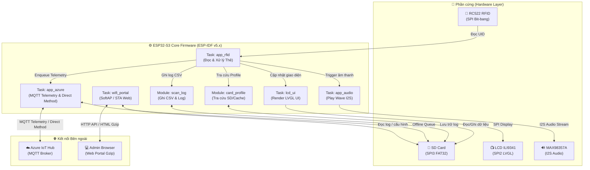

# 🏷️ ESP32-S3 RFID Attendance System


> **Hệ thống Chấm công & Quản lý Vào/Ra thông minh** chạy firmware trên vi điều khiển **ESP32-S3**, tích hợp đầu đọc thẻ RFID MFRC522, màn hình LCD hiển thị LVGL tiếng Việt, kết nối Cloud Azure IoT Hub, lưu trữ nhật ký SD Card, âm thanh I2S và Web Portal cấu hình qua WiFi.
>
> 📖 **Xem Tài liệu Kỹ thuật Chi tiết Chuẩn**: [DOCUMENTATION.md](DOCUMENTATION.md)

---

## 📌 Mục lục

- [📘 Tài liệu Kỹ thuật Chi tiết (DOCUMENTATION.md)](DOCUMENTATION.md)
- [Tổng quan Hệ thống](#-tổng-quan-hệ-thống)
- [✨ Tính năng Nổi bật](#-tính-năng-nổi-bật)
- [🏗️ Sơ đồ Kiến trúc System](#️-sơ-đồ-kiến-trúc-system)
- [🔌 Sơ đồ Chân & Kết nối Phần cứng (Pinout)](#-sơ-đồ-chân--kết-nối-phần-cứng-pinout)
- [🚀 Hướng dẫn Build & Nạp Firmware](#-hướng-dẫn-build--nạp-firmware)
- [📂 Cấu trúc Thư mục Dự án](#-cấu-trúc-thư-mục-dự-án)
- [💾 Cấu trúc Bộ nhớ Thẻ SD](#-cấu-trúc-bộ-nhớ-thẻ-sd)
- [🌐 Web Portal & Cloud Azure IoT Hub](#-web-portal--cloud-azure-iot-hub)
- [⚙️ Feature Flags & Cấu hình System](#️-feature-flags--cấu-hình-system)
- [⚡ Ưu tiên Vận hành System](#-ưu-tiên-vận-hành-system)
- [🔍 Xử lý Lỗi Thường gặp (Troubleshooting)](#-xử-lý-lỗi-thường-gặp-troubleshooting)

---

## 📋 Tổng quan Hệ thống

| Thông số | Chi tiết |
| :--- | :--- |
| **Chip xử lý** | ESP32-S3 Dual-Core Xtensa LX7 + PSRAM (Khuyên dùng $\ge 2\text{MB}$ PSRAM) |
| **Nền tảng Firmware** | ESP-IDF v5.x (C Native) |
| **Giao diện Người dùng** | LVGL 8.3 + LCD ILI9341 (320x240 px, hỗ trợ tiếng Việt) |
| **Đầu đọc thẻ RFID** | MFRC522 (Chuẩn MIFARE 13.56MHz) |
| **Lưu trữ dữ liệu** | SD Card (SPI3, chuẩn FAT32) |
| **Âm thanh Phản hồi** | Loa MAX98357A Class-D I2S (Phát file WAV từ SD Card) |
| **Kết nối Cloud** | Azure IoT Hub (MQTT QoS 1, SAS Token Auth, Offline Queue) |
| **Quản trị tại chỗ** | WiFi Portal Web Server (SoftAP `192.168.4.1` / Local STA IP) |

---

## ✨ Tính năng Nổi bật

- 📇 **Quẹt thẻ Siêu tốc**: Đọc UID thẻ RC522, tra cứu thông tin nhân viên trên thẻ SD và ghi log CSV tức thì.
- 🎨 **Màn hình LVGL Tiếng Việt**: Hiển thị popup kết quả quẹt thẻ, hình ảnh nhân viên, thời gian NTP thực và trạng thái mạng.
- 📶 **WiFi Portal Thông minh**: Tự động mở SoftAP cấu hình khi mất WiFi STA; giao diện Web mượt mà nén HTML Gzip.
- ☁️ **Đồng bộ Azure Cloud**: Gửi Telemetry QoS 1 real-time; khi mất mạng sẽ **tự động xếp hàng vào SD Card (Offline Queue)** và đẩy bù khi có kết nối.
- 🔊 **Âm thanh I2S Sống động**: Phát chuông thông báo WAV (Thành công, Thất bại, Chưa đăng ký) trực tiếp từ SD.
- 🔄 **Nâng cấp OTA**: Hỗ trợ nạp firmware từ xa qua đường dẫn URL hoặc upload trực tiếp `.bin` trên Web Portal.

---

## 🏗️ Sơ đồ Kiến trúc System



---

## 🔌 Sơ đồ Chân & Kết nối Phần cứng (Pinout)

Các chân GPIO được định nghĩa chi tiết tại [`main/board_pins.h`](file:///c:/esp/RFID/main/board_pins.h).

### 📺 1. Màn hình LCD ILI9341 (SPI2)

| Tín hiệu | GPIO Pin | Ghi chú |
| :--- | :---: | :--- |
| **SCK** | `GPIO 39` | SPI Clock |
| **MOSI** | `GPIO 40` | SPI Data Out |
| **MISO** | `GPIO 41` | SPI Data In |
| **DC** | `GPIO 9` | Data / Command Control |
| **CS** | `GPIO 10` | Chip Select LCD |
| **RST** | `GPIO 8` | Hardware Reset |

### 📇 2. Đầu đọc RFID RC522 (Bit-bang SPI)

| Tín hiệu | GPIO Pin | Ghi chú |
| :--- | :---: | :--- |
| **SCK** | `GPIO 11` | Bit-bang Clock |
| **MOSI** | `GPIO 12` | Bit-bang MOSI |
| **MISO** | `GPIO 13` | Bit-bang MISO |
| **CS** | `GPIO 4` | Chip Select RFID |
| **RST** | `GPIO 3` | Hardware Reset RFID |

> [!TIP]
> Hệ thống hỗ trợ dùng chung đường bus SPI với SD Card bằng cấu hình `#define BOARD_RC522_SHARE_SD_SPI_BUS 1`.

### 💾 3. Thẻ nhớ SD Card (SPI3)

| Tín hiệu | GPIO Pin | Ghi chú |
| :--- | :---: | :--- |
| **SCK** | `GPIO 21` | SPI3 Clock |
| **MOSI** | `GPIO 47` | SPI3 MOSI |
| **MISO** | `GPIO 48` | SPI3 MISO |
| **CS** | `GPIO 5` | Chip Select SD |

### 🔊 4. Mạch Khuếch đại Âm thanh MAX98357A (I2S)

| Tín hiệu | GPIO Pin | Ghi chú |
| :--- | :---: | :--- |
| **BCLK** | `GPIO 16` | Bit Clock |
| **WS** | `GPIO 17` | Word Select (LRCLK) |
| **DIN** | `GPIO 18` | Data Input |

---

## 🚀 Hướng dẫn Build & Nạp Firmware

### 🛠️ Yêu cầu Môi trường
- **ESP-IDF**: Version `v5.x` (Khuyến nghị v5.1 hoặc mới hơn)
- **Python**: Version `3.8+`
- **CMake**: Version `≥ 3.16`

### 📥 1. Clone Repo & Chuẩn bị
```bash
# Clone repository
git clone https://github.com/MebiEco/RFID.git
cd RFID

# Thiết lập target cho ESP32-S3
idf.py set-target esp32s3
```

### ⚙️ 2. Cấu hình Màn hình LCD
Mở menuconfig để chọn loại LCD phù hợp:
```bash
idf.py menuconfig
```
👉 Chuyển đến mục: **Man hinh LCD**:
- `1` — **GMT028 2.8″** *(Khuyến nghị)*
- `2` — **ILI9341 Legacy 2.8″**

### 🔨 3. Build & Flash Firmware
```bash
# Biên dịch dự án
idf.py build

# Nạp firmware và mở Monitor xem Serial Log
idf.py -p COMx flash monitor
```
*(Thay `COMx` bằng cổng Serial thực tế của bạn, ví dụ: `COM3` hoặc `/dev/ttyUSB0`)*

> [!IMPORTANT]
> Sau khi chỉnh sửa giao diện Web tại [`main/portal.html`](file:///c:/esp/RFID/main/portal.html), bạn cần nén lại file HTML Gzip bằng lệnh:
> ```bash
> python tools/pack_portal.py
> ```
> Nếu thay đổi các cấu hình trong [`sdkconfig.defaults`](file:///c:/esp/RFID/sdkconfig.defaults), hãy **xóa thư mục `build`** trước khi build lại để áp dụng thay đổi triệt để.

---

## 📂 Cấu trúc Thư mục Dự án

```text
RFID/
├── main/
│   ├── main.c                 # Điểm khởi chạy & khởi tạo các Task
│   ├── board_pins.h           # Định nghĩa chân GPIO & Feature Flags
│   ├── app_rfid.c/h           # Task quản lý & xử lý quẹt thẻ RFID
│   ├── mfrc522.c/h            # Driver giao tiếp RC522
│   ├── card_profile.c/h       # Tra cứu hồ sơ nhân viên trên SD Card
│   ├── attendance_day.c/h     # API tính toán tổng quan chấm công theo ngày
│   ├── scan_log.c/h           # Ghi log CSV & xử lý nhật ký quẹt thẻ
│   ├── wifi_portal.c/h        # Quản lý WiFi SoftAP / STA & Web Server
│   ├── portal_web.c/h         # Các handler API Web & nhúng HTML Gzip
│   ├── portal.html[.gz]       # Giao diện Web Admin Portal
│   ├── app_azure.c/h          # Client MQTT Azure IoT Hub & Offline Queue
│   ├── app_audio.c/h          # Task phát âm thanh WAV qua I2S
│   ├── app_ota.c/h            # Quản lý nâng cấp Firmware OTA
│   ├── lcd_ui.c / lv_port*.c  # Khởi tạo LCD & Driver LVGL 8.3
│   ├── sd_card.c/h            # Driver Mount SD SPI & DMA Bounce Buffer
│   └── ds3231.c/h             # Driver RTC phần cứng (Tùy chọn)
├── tools/
│   └── pack_portal.py         # Script đóng gói & nén portal.html -> portal_web.c
├── azure_commands.txt         # Tài liệu hướng dẫn Direct Method & Telemetry Azure
├── partitions.csv             # Bảng phân vùng Flash
├── sdkconfig.defaults         # Cấu hình mặc định của ESP-IDF
└── CMakeLists.txt             # File cấu hình build CMake dán nhãn phiên bản
```

---

## 💾 Cấu trúc Bộ nhớ Thẻ SD

Định dạng thẻ nhớ **FAT32**. Cấu trúc thư mục chuẩn trên thẻ SD như sau:

```text
/sdcard/
├── profiles/
│   ├── <UID>.txt          # File thông tin: [Họ Tên]|[Mã NV] (Ví dụ: 544C38C7.txt)
│   ├── <UID>.jpg          # Ảnh nhân viên (Tùy chọn)
│   └── default.jpg        # Ảnh mặc định khi không tìm thấy ảnh nhân viên
├── checkin/               # Thư mục lưu trạng thái Vào/Ra của từng thẻ UID
├── audio/
│   ├── 1.wav              # Âm thanh quẹt thẻ thành công (Vào)
│   ├── 2.wav              # Âm thanh quẹt thẻ thành công (Ra)
│   ├── 3.wav              # Âm thanh thẻ chưa đăng ký
│   └── 4.wav              # Âm thanh lỗi / cảnh báo
└── rfid_log.csv           # Nhật ký chấm công chuẩn format CSV
```

---

## 🌐 Web Portal & Cloud Azure IoT Hub

### 📶 1. Kết nối Web Portal
1. **Chế độ AP (Chưa cấu hình WiFi)**: Kết nối vào WiFi phát ra từ thiết bị → Mở trình duyệt truy cập: `http://192.168.4.1`
2. **Chế độ STA (Đã nối WiFi local)**: Truy cập qua IP được cấp bởi DHCP Router.

**Các tính năng trên Web Portal**:
- 📊 **Tổng quan**: Thống kê lượt quẹt thẻ, số nhân viên đã chấm công.
- 🛜 **Cấu hình WiFi**: Quét & kết nối WiFi.
- ☁️ **Azure IoT**: Cấu hình *HostName*, *Device ID*, *SAS Key*.
- 📇 **Quản lý Thẻ**: Thêm / Sửa / Xóa thông tin nhân viên theo UID.
- 📋 **Nhật ký**: Xem chi tiết log quẹt thẻ (Đọc từ cuối file CSV để tối ưu RAM).
- 🛠️ **Hardware & Terminal**: Kiểm tra bộ nhớ Heap RAM, DMA, dung lượng SD Card.
- 🔄 **OTA Update**: Upload file `.bin` nâng cấp firmware.

---

### ☁️ 2. Cấu hình Azure IoT Hub Telemetry

Gói dữ liệu Telemetry chuẩn JSON được gửi lên Azure qua protocol MQTT (QoS 1):

```json
{
  "Code": 602,
  "Index": 3919,
  "TimeStamp": 1787650593,
  "Data": {
    "DeviceName": "RFID_Scanner",
    "UID": "544C38C7",
    "Name": "Nguyen Van A",
    "ID": "NV0003"
  }
}
```

#### 📑 Bảng Mã Định danh Sự kiện (Event Code)

| Code | Ý nghĩa Sự kiện |
| :---: | :--- |
| **`601`** | Quẹt thẻ **chưa đăng ký** trên hệ thống |
| **`602`** | Quẹt thẻ **thành công** (Đã đăng ký) |
| **`603`** | Lưu / Cập nhật thông tin thẻ |
| **`604`** | Xóa thông tin thẻ khỏi hệ thống |
| **`605`** | Flush / Đồng bộ dữ liệu hàng đợi từ SD Card |
| **`606`** | Kích hoạt lệnh nâng cấp OTA |
| **`607`** | Thay đổi thông số cấu hình Azure IoT Hub (ChangeHub) |

---

## ⚙️ Feature Flags & Cấu hình System

Trong file [`main/board_pins.h`](file:///c:/esp/RFID/main/board_pins.h), bạn có thể bật/tắt các module tính năng để debug hoặc tối ưu dung lượng:

```c
#define BOARD_ENABLE_LCD    1   // Bật/tắt Màn hình LCD ILI9341
#define BOARD_ENABLE_RFID   1   // Bật/tắt Đầu đọc thẻ MFRC522
#define BOARD_ENABLE_SD     1   // Bật/tắt Thẻ nhớ SD Card
#define BOARD_ENABLE_WIFI   1   // Bật/tắt Kết nối WiFi & Web Portal
#define BOARD_ENABLE_AZURE  1   // Bật/tắt Kết nối Cloud Azure IoT Hub
#define BOARD_ENABLE_AUDIO  1   // Bật/tắt Âm thanh I2S MAX98357A

#define BOARD_SD_ONLY       0   // Bật chế độ chỉ test SD Card
#define BOARD_RFID_ONLY     0   // Bật chế độ chỉ test RC522

#define BOARD_LOCAL_UTC_OFFSET_SEC  (7 * 3600)  // Múi giờ Việt Nam (UTC+7)
```

---

## ⚡ Ưu tiên Vận hành System

Hệ thống điều phối tài nguyên CPU & RAM theo 3 cấp độ ưu tiên để đảm bảo tính thời gian thực cho việc quẹt thẻ:

```mermaid
gantt
    title Mức độ Ưu tiên Tài nguyên Hệ thống
    dateFormat X
    axisFormat %s

    section Ưu tiên 1 (Cao nhất)
    Quẹt thẻ RFID & Đẩy Azure Telemetry : active, p1, 0, 10
    section Ưu tiên 2 (Trung bình)
    Web Portal (Tạm nhường SD/RAM khi quẹt thẻ) : p2, 0, 10
    section Ưu tiên 3 (Thấp nhất)
    Nâng cấp Firmware OTA (Tạm dừng RFID/Azure/Audio) : p3, 0, 10
```



| Mức Ưu tiên | Thành phần | Mô tả Chi tiết |
| :---: | :--- | :--- |
| **🥇 Ưu tiên 1** | **Quẹt thẻ RFID & Azure** | Luôn chạy thường trực. Khi quẹt thẻ, hệ thống ưu tiên đọc SD và đẩy dữ liệu Cloud ngay lập tức. |
| **🥈 Ưu tiên 2** | **Web Portal** | Tự động tạm nhường băng thông SD Card và tài nguyên RAM khi thiết bị đang bận xử lý chuỗi quẹt thẻ. |
| **🥉 Ưu tiên 3** | **Firmware OTA** | Khi chạy OTA, hệ thống tạm dừng RFID, Azure và Audio để ghi ROM an toàn; tự động khôi phục nếu thất bại. |

---

## 🔍 Xử lý Lỗi Thường gặp (Troubleshooting)

> [!WARNING]
> **Đầu đọc RC522 không nhận thẻ**:
> - Kiểm tra nguồn cấp đúng 3.3V (Không dùng 5V).
> - Kiểm tra lại thứ tự các chân GPIO bit-bang.
> - Thử hạ tần số SPI RC522 xuống `RC522_SPI_CLOCK_HZ (500000)`.

> [!IMPORTANT]
> **LCD bị lệch màu hoặc ngược hình**:
> - Đảm bảo đã chọn đúng cấu hình màn hình trong `menuconfig` -> **Man hinh LCD**.
> - Bật flag `#define BOARD_LCD_STARTUP_SOLID_RED_TEST 1` để kiểm tra màu đỏ chuẩn khi khởi động.

> [!CAUTION]
> **Thẻ SD bị lỗi Mount (Mount error)**:
> - Hiện tượng hay xảy ra khi sụt áp lúc bật WiFi. Cần đảm bảo nguồn microUSB / Type-C cấp đủ dòng $\ge 1\text{A}$.
> - Thử giảm `#define BOARD_SD_SPI_MAX_FREQ_KHZ` xuống `10000` hoặc tăng `BOARD_SD_PRE_MOUNT_DELAY_MS`.

> [!TIP]
> **Tài nguyên RAM / Internal Heap bị thấp khi mở Web**:
> - Đóng bớt tab **Nhật ký** hoặc **Tổng quan** trên Web Portal để nhả socket HTTP.
> - An toàn hệ thống: **Internal Heap trống $\ge 20\text{KB}$**, khối DMA liên tục $\ge 8\text{KB}$.

---

## 🤝 Đóng góp & Giấy phép

### 👥 Đóng góp Dự án
1. **Fork** repository từ [MebiEco/RFID](https://github.com/MebiEco/RFID)
2. Tạo nhánh tính năng mới: `git checkout -b feature/AmazingFeature`
3. Commit thay đổi: `git commit -m 'Add some AmazingFeature'`
4. Push lên branch: `git push origin feature/AmazingFeature`
5. Mở một **Pull Request** để nhận hỗ trợ code review.

### 📄 Giấy phép (License)
Dự án thuộc bản quyền nội bộ dự án **MebiEco**.
----------------------------ĐỒ ÁN SINH VIÊN ECO-----------------------------
